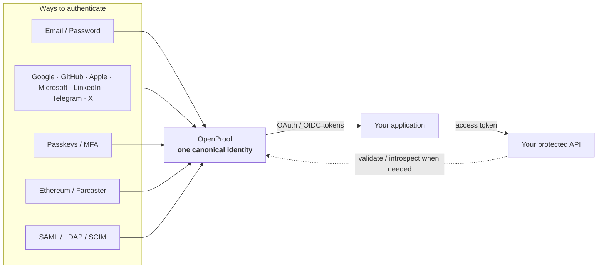
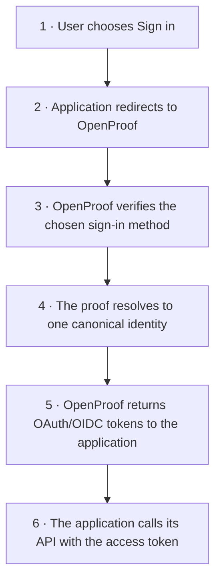

# OpenProof

**Self-hosted identity infrastructure for applications, APIs, wallets, and enterprise systems.**

[Product](https://genyleap.com/products/openproof) ·
[Documentation](https://docs.genyleap.com/openproof/) ·
[Developer Portal & API Sandbox](https://docs.genyleap.com/openproof/api/) ·
[OpenAPI](docs/openapi.yaml)

OpenProof provides one canonical identity layer while keeping authentication,
proof, trust, sessions, and authorization as separate security boundaries. It is
designed to run inside your own infrastructure and keep identity data under your
control.

> Current release: **1.1.0-rc1** · C++26 · PostgreSQL · self-hosted

## What OpenProof includes

- Account enrollment, verified email/phone ownership, profiles, sessions, MFA,
  recovery codes and passkeys.
- OAuth 2.0 / OpenID Connect with Authorization Code + PKCE, Device Flow,
  client credentials, token exchange, PAR, JAR/JARM, revocation and introspection.
- Federated sign-in with Google, GitHub, Microsoft, Apple, LinkedIn, Telegram and X.
- Ethereum wallet authentication with SIWE and Farcaster authentication with SIWF.
- SAML, LDAPS and SCIM for enterprise identity and provisioning.
- Organization membership, RBAC, application/client registration and an
  owner-protected administration surface.
- Evidence and trust primitives that remain separate from authorization policy.
- C++, JavaScript, Swift and Kotlin SDK foundations.

## What OpenProof does

OpenProof sits between **the ways a person can prove who they are** and **the
applications that need to trust that identity**.

Different sign-in methods converge into one canonical OpenProof identity.
Applications receive OAuth/OIDC tokens; they do not need to own provider
credentials, wallet proofs, passwords, or the OpenProof browser session.



The important part is the convergence: the same person can sign in with several
methods without becoming several unrelated product accounts.

For example, a user can first sign in with GitHub and later attach an Ethereum
wallet. Both proofs can resolve to the **same OpenProof subject**, so the
application still sees one user.

## Sign-in flow

A normal application integration can be understood as six steps:



Behind those six steps, OpenProof owns the security-sensitive work: provider
callbacks, authentication ceremonies, identity linking, session lifecycle,
token issuance, assurance, policy, and durable identity state.

For the internal C++ module graph and trust boundaries, see
[docs/ARCHITECTURE.md](docs/ARCHITECTURE.md).

## Install

On a supported Ubuntu or Debian host:

```bash
curl -fsSL https://genyleap.com/install/openproof | sudo sh
```

The installer prefers a matching GitHub Release package and verifies its published
SHA-256 checksum. Until a prebuilt package exists for the selected channel, Ubuntu
hosts automatically fall back to a source build. The same wizard then guides you
through PostgreSQL, secrets, the initial owner, email delivery, authentication
providers, Nginx and TLS.

See [Installation](docs/INSTALLATION.md) for package-only, version-pinned and
non-interactive deployments.

## Build from source

OpenProof currently targets **GCC 16** with C++26 modules.

Required components:

- GCC 16
- CMake 3.30+
- Ninja
- OpenSSL 3+
- Boost 1.88+
- PostgreSQL client libraries 15+
- tomlplusplus

```bash
cmake --preset gcc-release
cmake --build --preset gcc-release
ctest --preset gcc-release
```

For compiler/module details, see [C++26 toolchain notes](docs/CXX26.md).

### Run the local end-to-end demo

```bash
./scripts/quickstart-local-demo.sh
```

The demo creates an isolated temporary PostgreSQL instance, starts OpenProof
behind a local TLS edge, exercises the identity/OAuth flow, and removes the
temporary environment when it exits.

For the interactive Qt/QML client and local Developer Portal:

```bash
./scripts/run-qml-demo.sh
```

You can also explore the public browser-isolated sandbox without installing
anything:

**https://docs.genyleap.com/openproof/api/**

### Configure a deployment

A single generic configuration example is kept in
[examples/openproof.toml](examples/openproof.toml).

Before starting a real deployment, use the complete
[configuration reference](docs/CONFIGURATION.md) and the reviewed templates in
[deploy/](deploy/).

```bash
./cmake-build-gcc-release/apps/opp/opp check-config --config openproof.toml
./cmake-build-gcc-release/apps/opp/opp server --config openproof.toml
```

OpenProof should normally listen on loopback behind a trusted TLS reverse proxy.

## SDKs

A minimal C++ relying-party integration is available in
[examples/reference-client](examples/reference-client).

| SDK | Location |
|---|---|
| C++ | [sdk/cpp](sdk/cpp) |
| JavaScript | [sdk/javascript](sdk/javascript) |
| Swift | [sdk/swift](sdk/swift) |
| Kotlin | [sdk/kotlin](sdk/kotlin) |

The protocol remains HTTP + OAuth/OIDC, so using an OpenProof SDK is optional.

## Documentation

| Topic | Repository reference |
|---|---|
| Installation | [docs/INSTALLATION.md](docs/INSTALLATION.md) |
| Architecture | [docs/ARCHITECTURE.md](docs/ARCHITECTURE.md) |
| Configuration | [docs/CONFIGURATION.md](docs/CONFIGURATION.md) |
| API integration | [docs/API_GUIDE.md](docs/API_GUIDE.md) |
| Provider setup | [docs/PROVIDER_SETUP.md](docs/PROVIDER_SETUP.md) |
| Operations | [docs/OPERATIONS.md](docs/OPERATIONS.md) |
| Delivery webhook | [docs/DELIVERY_WEBHOOK.md](docs/DELIVERY_WEBHOOK.md) |
| WalletConnect / EVM wallets | [docs/WALLETCONNECT.md](docs/WALLETCONNECT.md) |
| Threat model | [docs/THREAT_MODEL.md](docs/THREAT_MODEL.md) |
| Security invariants | [docs/SECURITY_INVARIANTS.md](docs/SECURITY_INVARIANTS.md) |
| Release process | [docs/RELEASING.md](docs/RELEASING.md) |
| OpenAPI 3.1 | [docs/openapi.yaml](docs/openapi.yaml) |

The hosted documentation is the best entry point for application developers:

- **Docs:** https://docs.genyleap.com/openproof/
- **Interactive API:** https://docs.genyleap.com/openproof/api/
- **Product:** https://genyleap.com/products/openproof

## Repository layout

```text
apps/         OpenProof server binary
src/          identity, auth, OAuth/OIDC, policy, storage and protocol modules
sdk/          client SDK foundations
examples/     one deployment config, reference client and QML demo
migrations/   PostgreSQL migrations
tests/        unit, integration and security tests
fuzz/         boundary fuzzing harness
deploy/       generic Linux/systemd/Nginx templates
docs/         implementation and operator documentation
scripts/      local demos, verification and qualification tooling
```

## Security

OpenProof handles credentials and identity state. Review
[SECURITY.md](SECURITY.md) before reporting a vulnerability and
[docs/THREAT_MODEL.md](docs/THREAT_MODEL.md) before deploying the service.

Do not commit provider credentials, signing keys, database URLs, bearer tokens,
or production configuration secrets.

## Contributing

Small, focused changes are preferred. Build and test the affected surface before
opening a pull request. See [CONTRIBUTING.md](CONTRIBUTING.md).
