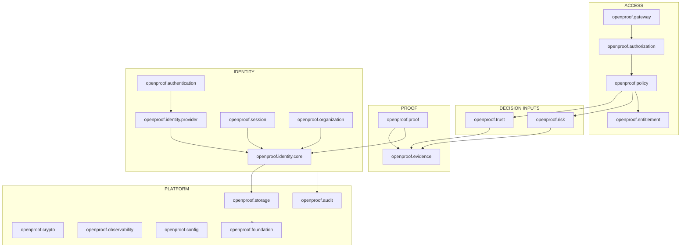

# OpenProof Protocol — Phase 0: Repository Audit

> v1.0.13 production note: fail-closed internal invariants are enforced by `foundation::requireInvariant`; GCC experimental Contracts are opt-in qualification-only because of module ICEs on the qualified GCC 16.1/Darwin toolchain.

Status: **Audit only. No OpenProof code written. Stop-and-verify gate before Phase 1.**
Date: 2026-08-05
Method: every claim below was produced by running a command or reading a file in
this repository. Nothing is inferred from memory.

> **Headline:** this is **not** a greenfield audit. The repository already
> contains a working, green, 90-file identity platform built under a different
> product identity (`OpenProof` / "OpenProof Identity Protocol"). It configures, builds with
> zero warnings under `-Werror`, and passes 169 tests. The work of Phase 1 is
> therefore *renaming and re-aiming an existing asset*, not starting from zero —
> and the audit's job is to say precisely what carries over, what conflicts with
> the OpenProof brief, and what is simply absent.

---

## 1. Current repository architecture

A modular monolith of C++26 modules, layered so dependencies point one way.

```
apps/opp  ── composition root
     │
     ├── openproof.identity.core       Identity, SubjectKind, linking state machine
     ├── openproof.identity.provider   Authentication SPI, transactions, assurance
     ├── openproof.policy              Authorization decision model
     ├── openproof.config              Typed configuration, secret references
     ├── openproof.security            CSPRNG, SHA-256, constant-time compare
     ├── openproof.observability       Structured JSON logging
     └── openproof.foundation          Errors, Result, ids, time, secrets, encodings
```

27 module interface units (`.cppm`), namespaces mirroring module identity.
Cohesive layers use module partitions; independently pluggable components
(`openproof.identity.provider`) are separate dotted modules.

| Layer | Partitions |
|---|---|
| `openproof.foundation` | `:error :result :json :encoding :secret :id :time` |
| `openproof.identity.core` | `:identity :link` |
| `openproof.identity.provider` | `:assurance :outcome :authenticator :registry :transaction` |
| `openproof.policy` | `:decision` |
| `openproof.security` | `:random :hash` |
| `openproof.observability` | `:log` |
| `openproof.config` | — |

---

## 2. Existing technology stack

| Component | Version | Note |
|---|---|---|
| Compiler | **GCC 16.1.0** (Homebrew) | Required, not preferred — see §5 |
| Standard library | libstdc++ 20260430 | |
| Language | **C++26** (`__cplusplus = 202400`) | target-local via `target_compile_features` |
| CMake | 4.4.1 | |
| Generator | Ninja 1.13.2 | required for module scanning |
| Host | macOS 26.5.1, aarch64 | |
| OpenSSL | 3.6.3 | crypto boundary |
| tomlplusplus | 3.4.0 | header-only, non-throwing API |
| GoogleTest | 1.17.0 | built from source, pinned by SHA-256 |

C++26 features in active use: **contracts (P2900)**, **`#embed`**,
**`std::text_encoding`**, `std::monostate`, concepts, `= delete("reason")`,
`std::expected`. Measured matrix in [03-CXX26.md](03-CXX26.md).

---

## 3. Build system

Target-based CMake. No global flag mutation.

- `cmake/OpenProofToolchainGuard.cmake` — hard-fails on unsupported toolchain, quoting
  observed values. Rejects Clang (no contracts, no reflection) and detects a C++
  driver wrongly placed in `CMAKE_C_COMPILER`.
- `cmake/OpenProofModule.cmake` — `openproof_add_module()`, registers `.cppm` through
  `FILE_SET CXX_MODULES`, enables `CXX_SCAN_FOR_MODULES`.
- `cmake/OpenProofCompileOptions.cmake` — warnings-as-errors, hardening, `-fcontracts`
  at **compile and link**, contract semantic selection.
- `cmake/toolchains/gcc.cmake` — discovers GCC without committing a machine path.
- `CMakePresets.json` — `gcc-debug`, `gcc-release`, `gcc-observe`.

**Verified this session, clean tree:**

```
cmake --preset gcc-debug        → CONFIGURE PASS
cmake --build --preset gcc-debug → BUILD PASS, 0 errors, 0 warnings
ctest --preset gcc-debug         → 169/169 PASS
```

---

## 4. C++ standard

C++26, requested per target. `CMAKE_CXX_EXTENSIONS OFF`. No `import std;`
(unavailable — §7). Standard headers live in each module's global module
fragment.

---

## 5. Compiler / toolchain

GCC 16 is a hard requirement because contracts and reflection are used or
planned through **standard syntax with no portability macro facade**. Clang
22.1.8 implements neither (`__cpp_contracts` and `__cpp_impl_reflection` both
undefined) and is rejected at configure time with a diagnostic naming the gap.

Two toolchain defects are recorded with reduced test cases in
[03-CXX26.md](03-CXX26.md):

1. **Contracts silently vanish** when `pre`/`post` are attached to a declaration
   whose definition is out-of-line in a module implementation unit. No
   diagnostic, no check. The project works around this by using
   `contract_assert` in bodies.
2. **`-freflection` breaks module partitions** with "conflicting imported
   declaration" from libstdc++/SDK headers. Reflection is therefore available
   but not enabled.

---

## 6. Module structure

See §1. The rule in force: a cohesive layer is one module with partitions so the
namespace mirrors module identity; an independently swappable component is its
own dotted module.

---

## 7. Dependencies

| Dependency | Reason | Sourcing |
|---|---|---|
| OpenSSL 3.6 | CSPRNG, SHA-256, constant-time compare. Crypto is never hand-written. | system, `find_package` |
| tomlplusplus 3.4 | Typed configuration parsing | header-only, non-throwing mode |
| GoogleTest 1.17 | Test framework | FetchContent, URL + SHA-256 pinned |

Absent and deliberately so: no HTTP stack, no database client, no JSON parser
(a small non-parsing JSON *writer* is owned by `openproof.foundation`), no telemetry
SDK. Each arrives with the phase that needs it.

`import std;` is unavailable: Homebrew's GCC 16 ships `bits/std.cc` as a **1-byte
stub**, so CMake's `CXX_MODULE_STD` cannot work.

---

## 8. Existing tests

169 tests across 15 files, all passing. Framework: GoogleTest + CTest with
`gtest_discover_tests`.

```
config/config_test.cpp            foundation/{encoding,error,id,json,result,secret,time}_test.cpp
identity/core_test.cpp            identity/provider_test.cpp
identity/transaction_test.cpp     observability/log_test.cpp
policy/decision_test.cpp          security/security_test.cpp
storage/repository_test.cpp
```

Beyond ordinary unit coverage these include **compile-time** security tests
(`static_assert` that a secret is not formattable, not stream-insertable, not
copyable, not equality-comparable) and **death tests** proving contract
violations terminate with the standard diagnostic.

---

## 9. Existing reusable infrastructure

This is what OpenProof inherits rather than rebuilds. It is substantial.

| Asset | OpenProof relevance |
|---|---|
| `Secret<T>` — redaction enforced by the type system | §36 "never log credentials" becomes a compile error |
| Two-channel `Error` (client-safe vs operator-only) + JSON envelope | §69 structured error model |
| `Result<T>` over `std::expected` | §47 |
| `StrongId<Tag>` phantom-typed identifiers | §6 "external identifiers never become canonical IDs" |
| Injected `ClockSource` (system + manual) | deterministic tests for freshness, expiry, TTL (§14) |
| CSPRNG, SHA-256, constant-time compare over OpenSSL | §37 |
| Canonical base64url with **non-canonical encoding rejected** | replay/nonce integrity (§9) |
| Structured JSON logger, correlation IDs, nested fields | §39 |
| Typed config with **inline secrets rejected** | §44 |
| `AuthenticationTransaction` + single-use store | §9 — already the shape OpenProof asks for |
| Assurance model (`AssuranceLevel`, `AuthenticationStrength`) | §27 |
| Provider SPI with `ProviderId` + `InteractionModel` | §8, §49 |
| Identity core: `Identity`, `SubjectKind`, `LinkState` machine | §6, §7, §51 |
| `AuthorizationDecision` with 4-valued `DecisionKind` | §21 |
| `docs/04-INVARIANTS.md` — 10 invariants with enforcement + proving test | §59 |

### Already compliant with OpenProof's explicit prohibitions

Worth stating, because these are the rules most implementations get wrong:

- **§49 satisfied.** There is no `enum class ProviderKind { Google, GitHub, … }`.
  Providers are identified by an opaque `ProviderId` string and described by a
  protocol-neutral `InteractionModel` (`Redirect`, `ChallengeResponse`,
  `OutOfBand`, `Assertion`, `Delegated`).
- **§50 satisfied.** `ClaimName` contains no Web3 vocabulary — no
  `WalletAddress`, no `ChainId`, no `ENSName`, no `FarcasterFID`.
- **§7 satisfied.** `SubjectKind` already models `Human`, `Service`, `Workload`,
  `Organization`.
- **§21 satisfied.** `DecisionKind` is `Allow | Deny | NotApplicable |
  Indeterminate`; errors do not collapse into allow.
- **§51 satisfied.** Linking is a state machine reaching `Linked` only via
  `Verified`, with a test proving matching attributes do not merge identities.

---

## 10. Architectural conflicts

Each conflict is stated with its resolution. Nothing is silently absorbed.

| # | Conflict | Severity | Resolution |
|---|---|---|---|
| **C-1** | **Product identity.** Everything is `openproof.*` / `openproof::` / `GIP_*` / `opp`, and `project()` describes it as "OpenProof Protocol reference implementation". OpenProof §1 forbids OpenProof as the primary name and forbids the deployment operator terminology in the protocol core. | **Blocking** | Full rename to `openproof.*` / `openproof::` / `OPENPROOF_*`. Mechanical but touches ~90 files including every module name, namespace, CMake variable and document. Must be one atomic change with a green build on both sides. |
| **C-2** | **§45 generic CRUD repository.** `Repository<EntityT, IdT>` with `insert/update/upsert/findById/contains/remove/count` is the *primary* storage abstraction, and there are **zero** domain repositories. §45 explicitly forbids this. | **High** | Introduce domain repositories (`IdentityRepository`, `ExternalIdentityRepository`, `SessionRepository`, `ProofRepository`, `EvidenceRepository`, `AuditRepository`, `OrganizationRepository`, `PolicyRepository`) exposing domain operations. The generic template may survive only as a private in-memory test helper, never as the domain-facing contract. |
| **C-3** | **Missing subsystems.** OpenProof requires proof, evidence, trust, risk, evidence graph, organization, entitlement, gateway, discovery, rate limiting, circuit breaking, load balancing, PostgreSQL persistence, migrations, audit, admin API and CLI. None exist. | **Expected** | Delivered by Phases 4–10. Not a defect; recorded so the gap is explicit. |
| **C-4** | **§59/§60 documents.** `docs/04-INVARIANTS.md` exists (10 invariants) but OpenProof names `docs/SECURITY_INVARIANTS.md`; `docs/THREAT_MODEL.md` does not exist. | Medium | Rename/expand 04 into `SECURITY_INVARIANTS.md` using the required 4-field form (what must be true / how enforced / which test proves it / what happens on failure). Author `THREAT_MODEL.md` in Phase 12, seeded earlier. |
| **C-5** | **§48 module graph differs.** OpenProof names `openproof.crypto`, `openproof.authentication`, `openproof.session`, `openproof.credentials`, `openproof.proof`, `openproof.evidence`, `openproof.trust`, `openproof.risk`, `openproof.authorization`. Current tree has `openproof.security` and folds authentication into `openproof.identity.provider`. | Medium | Adopt OpenProof names where they carve at a real joint. `security → crypto`. Split `identity.provider` into `authentication` (transactions, SPI, assurance) and `credentials`. §48 also says "do not create modules merely because they sound elegant" — so `session` and `credentials` are created when they hold real code, not upfront. |
| **C-6** | **Vendor neutrality of docs.** README is titled "OpenProof Protocol … for the deployment's ecosystem". | **Blocking** | Rewrite as OpenProof, vendor-neutral. the deployment operator becomes an example deployment only. |
| **C-7** | **Self-hosting story absent.** §4 requires deployment-operator data ownership as an architectural property. Nothing currently states or enforces it. | Medium | Document in architecture; enforce via the storage boundary (no phone-home, no external dependency at runtime). Add as a security invariant. |
| **C-8** | **No CI, no commits.** 89 uncommitted entries; no `.github/workflows`. §73 requires build/test/static analysis after every phase. | Medium | Establish CI in Phase 1 so every later phase has a gate. Committing remains the operator's decision. |
| **C-9** | **Reflection blocked** by a GCC defect (§5). It would otherwise generate enum wire names. | Low | Already documented. Revisit when fixed; nothing depends on it. |
| **C-10** | **Stale `GENY_` strings.** 4 remain in `cmake/toolchains/gcc.cmake` (comment + `FATAL_ERROR` remediation text) and `README.md`. The error message names a variable that no longer exists, sending an operator down a dead end. | Low | Fixed by the C-1 rename. |

---

## 11. Security risks in the current state

Present-state risks, distinct from future work.

1. **Generic repository weakens tenant isolation (C-2).** A CRUD interface keyed
   only by id has no place to enforce organization scoping, so isolation would
   depend on every call site remembering a predicate. §23 requires isolation by
   design. This is the strongest technical reason to resolve C-2 before Phase 8.
2. **No persistence yet.** Identity, transactions and links live in in-memory
   adapters. Correct for this phase, but nothing durable is protected yet, and
   the single-use transaction guarantee currently holds only within one process.
   A multi-node deployment would break it until the store is backed by a database
   with atomic redemption.
3. **No transport.** `opp` opens no listener, so there is no live attack
   surface — and equally, none of the §36 transport-level protections
   (smuggling, header injection, SSRF) have been exercised.
4. **Contracts terminate the process under `enforce`.** Correct for internal
   invariants, but a contract accidentally placed on attacker-controlled input
   would become a remote shutdown. The rule "contracts guard internals, `Result`
   guards the perimeter" is documented and must be enforced in review; it is not
   yet mechanically checkable.
5. **No CI (C-8)** means the green state is verified only when someone runs it.
6. **Uncommitted work.** 89 entries exist only in the working tree.

No credential-handling, logging-leak or authorization-bypass defect was found in
the current code. The `Secret` type, the two-channel error model and the
four-valued decision model are all doing what they claim.

---

## 12. Applicable C++ project rules

External engineering authority, as required by §71:

- Repository: `https://github.com/thecompez/ai-for-modern-cpp`
- **Revision pinned: `326cd850c2cb5e39264b7d2ccf2c29fba6627380`** (2026-07-26)
- Verified this session to still be `main` HEAD.

Guides read in full and applied: `AGENTS.md` (canonical), `START_PROJECT.md`,
`MODULES.md`, `CMAKE_AND_TOOLCHAINS.md`, `ARCHITECTURE.md`, `NAMING.md`,
`SYNTAX_AND_STYLE.md`, `ERRORS_AND_RESOURCES.md`, `API_DESIGN.md`,
`TESTING_AND_VERIFICATION.md`, `COMMON_FAILURES.md`.

Not applicable: `QT_QUICK_UI.md`, `APP_ICONS_AND_BRANDING.md` (GUI-*, APP-*) —
OpenProof is a server, a gateway and a CLI. Recorded as a rule exception.

### Recorded deviations from the contract

| Rule | Deviation | Justification |
|---|---|---|
| BLD-013 (single std-library delivery mode) | Contract semantic is a build option (`OPENPROOF_CONTRACT_SEMANTIC`) | Not a std-library delivery mode; it is the semantic P2900 itself defines. Default `enforce`. |
| MOD-010 (no `import std;`) | Complied with — but by necessity, not choice | libstdc++ module source is a stub (§7) |

### Project identity (INI-001/INI-003)

The name was supplied unambiguously by the human, so the initiation gate is
satisfied without asking. Derived identifiers:

| Identity | Value |
|---|---|
| Display name | OpenProof Protocol |
| Short name | OpenProof |
| Abbreviation | OPP |
| CMake project | `openproof` |
| C++ module prefix | `openproof.` |
| C++ namespace | `openproof::` |
| CMake cache prefix | `OPENPROOF_` |
| CLI binary | `opp` (§57: `opp server`, `opp identity`, …) |

**One open question for Phase 1:** §57 lists `opp server` as a CLI subcommand,
which reads as a single `opp` binary. The current tree has a separate daemon
(`opp`). Proposal: one `opp` binary with an `opp server` subcommand, since it
matches §57 literally and keeps one API surface (§57: "CLI operations should use
the same APIs/contracts"). Flagged rather than assumed.

---

## 13. Target OpenProof architecture



The separation the brief demands (§3) is preserved as a module boundary, not a
comment: **identity ≠ authentication ≠ proof ≠ evidence ≠ trust ≠ risk ≠ policy
≠ authorization**. Nothing collapses into a single score or boolean.

Two boundaries deserve emphasis:

- **`openproof.evidence` is untrusted-by-default.** Evidence carries source,
  provenance, verification state, freshness and confidence (§14). Nothing may
  read a provider's assertion as fact (§61).
- **`openproof.trust` returns dimensions, not a number** (§16, §33). There is no
  canonical `trustScore`.

---

## 14. Implementation phases

Mapped to §72, adjusted for what already exists.

| Phase | Contents | Status |
|---|---|---|
| **0** | This audit | **complete** |
| **1** | Rename to OpenProof (C-1, C-6, C-10); resolve C-2 domain repositories; CI (C-8); `SECURITY_INVARIANTS.md` (C-4) | **complete** |
| **2** | Identity core completion: organization context, merge flow, tenant isolation | **complete** |
| **3** | Authentication: sessions, credentials, MFA, recovery; then providers (generic OIDC → WebAuthn → email/phone → Web3 → social → enterprise) | **local operational path complete** — HTTP login/MFA/session/recovery plane plus durable local provider; generic OIDC/WebAuthn and other adapters pending |
| **4** | Proof & evidence: lifecycle, provenance, freshness, revocation, provider evidence SPI, mock adapters | not started |
| **5** | Trust & risk: dimensions, signals, Sybil-resistance abstraction, explainable decisions | not started |
| **6** | Policy & authorization: RBAC, ABAC, assurance/trust/risk/entitlement-aware policy | **route RBAC/assurance complete** — immutable exact method/path rules with `any`/`all` roles and minimum IAL; ABAC, trust/risk and entitlement evaluation pending |
| **7** | Gateway: HTTP, routing, enforcement, rate limit, LB, circuit breaker, discovery, proxy | **complete for HTTP/1.1 edge/core** — runnable public or explicit fail-closed authenticated protected single-upstream mode |
| **8** | Storage: PostgreSQL adapter, migrations, transactions | **authentication path complete** — pool, migrations, identities, links, organizations, memberships, local credentials, sessions, auth transactions and recovery codes |
| **9** | Audit & observability: audit events, metrics, tracing, security event stream | **core complete** — HMAC chain, bounded Prometheus metrics, W3C trace context and security-event sink |
| **10** | Administration: management API, `opp` CLI | **bootstrap and local-member lifecycle complete** — atomic offline first-owner ceremony plus IAL2 owner-only creation, role replacement, suspension/reinstatement/removal and credential reset; tenant/policy lifecycle pending |
| **11** | SDK & developer experience: docs, examples | not started |
| **12** | Hardening: threat model, sanitizers, fuzzing, load, failure injection | **baseline complete** — threat model, ASan/UBSan preset, randomized boundary corpus, concurrency and failure tests |

Phase 1 is deliberately *not* new features. Renaming 90 files and replacing the
storage abstraction while the tree is small is far cheaper than doing it after
Phases 4–10 have multiplied the call sites.

---

## 15. Concrete first milestone

**M1 — "OpenProof in name and in storage shape, still green."**

Deliverables:

1. **Rename** `gip` → `openproof` across module names, namespaces, CMake
   variables, targets, file names, presets and documentation. `opp` → `opp`
   (subject to the §57 question in §12). Zero `GENY`/`OpenProof`/`Geny` strings remain
   outside historical notes.
2. **Replace the generic CRUD repository (C-2)** with domain repositories.
   Introduce `IdentityRepository` and `ExternalIdentityRepository` as the first
   two, backed by in-memory adapters, with organization scoping present in the
   signature from the start so tenant isolation has somewhere to live.
3. **`docs/SECURITY_INVARIANTS.md`** in the §59 four-field form, carrying the 10
   existing invariants forward and adding: external identifiers never canonical;
   linking never transfers ownership; authorization fails closed; private keys
   never enter the system; tenant isolation; client identity headers untrusted.
4. **CI** running configure, build (warnings-as-errors) and the full test suite
   on every change.
5. **README and architecture docs** rewritten vendor-neutral: OpenProof is the
   protocol, the deployment operator is at most an example deployment.

**Acceptance:** clean configure; clean build with zero warnings under `-Werror`;
all tests passing with a count no lower than the current 169; `opp --version`
runs; no `gip`/`OpenProof` identifier anywhere in `src/`, `apps/`, `tests/` or
`cmake/`; CI green.

**Explicitly out of scope for M1:** proof, evidence, trust, risk, gateway,
PostgreSQL, audit, admin API, and any authentication provider. Those are Phases
3–10 and will not be stubbed, because an empty module that looks implemented is
worse than an absent one.

---

## Stop-and-verify gate

Per §72, Phase 0 ends here and awaits confirmation before Phase 1 begins. The
two decisions worth confirming first:

1. **Binary naming** — single `opp` with an `opp server` subcommand, or separate
   `openproofd` daemon plus `opp` CLI?
2. **Rename timing** — do the full rename now as M1 (recommended: the tree is at
   its smallest it will ever be), or defer it until after more subsystems land?
