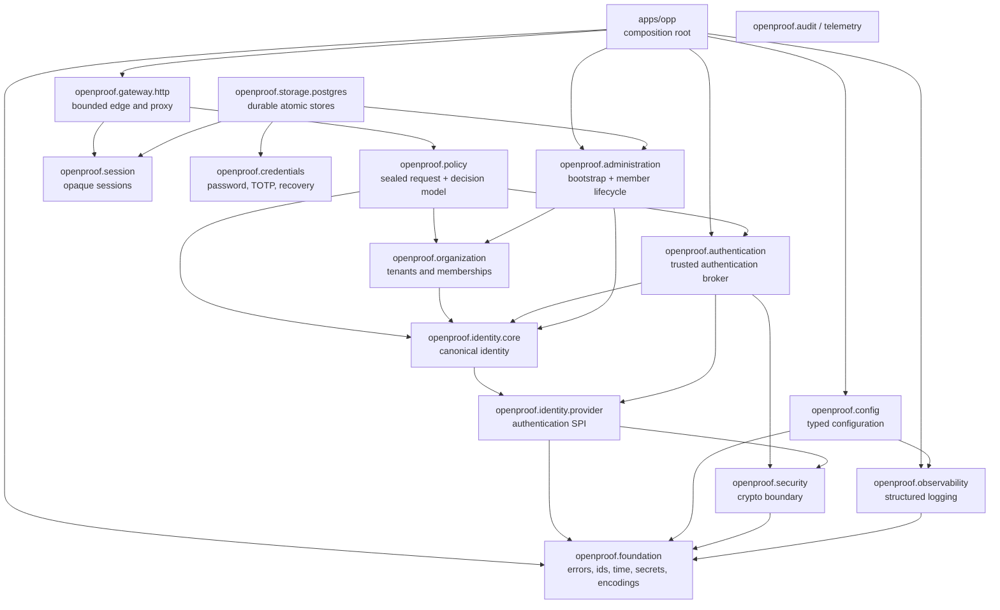
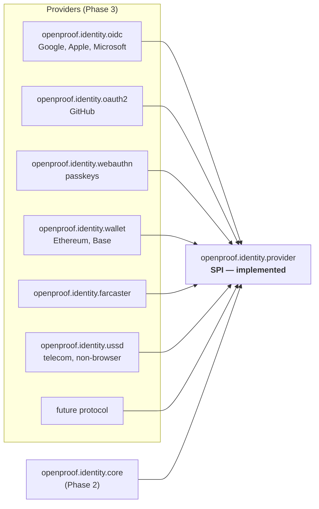

# OpenProof Protocol — Architecture

Status: **Authentication, gateway, critical PostgreSQL stores and observability implemented and verified.**

This document describes the architecture that exists in the repository today and
the shape the later phases are built to fit. Anything not yet implemented is
marked as such rather than described as if it were done.

---

## 1. Layering

Dependencies point downward only. The link graph in CMake is the enforcement
mechanism: a layer cannot import a layer above it because it does not link it.



`openproof.foundation` depends on nothing else in the project. It is the only layer
every other layer may assume.

### Module inventory

| Module | Partitions | Owns |
|---|---|---|
| `openproof.foundation` | `:error` `:result` `:json` `:encoding` `:secret` `:id` `:time` | Failure representation, `Result`, identifiers, time, secret handling, wire encodings |
| `openproof.security` | `:random` `:hash` | CSPRNG, SHA-256, constant-time comparison |
| `openproof.observability` | `:log` | Structured JSON logging with correlation identifiers |
| `openproof.config` | — | Typed configuration, environment overrides, secret references |
| `openproof.identity.provider` | `:assurance` `:outcome` `:authenticator` `:transaction` `:registry` | The authentication provider SPI |
| `openproof.authentication` | `:service` | Trusted orchestration, single-use enforcement and assurance adjudication |
| `openproof.identity.core` | `:identity` `:link` `:repository` `:merge` | Canonical identity and explicit association lifecycle |
| `openproof.organization` / `.membership` | organization, membership, repository | Tenant and organization-scoped role lifecycle |
| `openproof.policy` | `:decision` | Sealed authorization request plus immutable exact-route RBAC/assurance engine |
| `openproof.session` | model, repository, service | Opaque sessions, absolute/idle expiry, rotation and revocation |
| `openproof.credentials` | — | Pepper+scrypt passwords, RFC 6238 TOTP, recovery codes |
| `openproof.administration` / `.http` | — | Validated bootstrap, enrollment, role, membership-state and credential-rotation commands plus IAL2 administrative HTTP boundary |
| `openproof.provider.local` | — | Concrete password and password+TOTP provider |
| `openproof.gateway` / `.http` | — | Routing, enforcement, throttling, discovery, load balancing, circuits and Beast transport |
| `openproof.storage.postgres` | — | Bounded pool, migrations, durable auth/identity stores and atomic owner-authorized administration adapter |
| `openproof.audit` / `.telemetry` | — | HMAC audit chain, security events, bounded metrics and trace context |

48 module interface units (`.cppm`), 38 implementation units (`.cpp`).
Zero `.h` / `.hpp` files. Zero uses of `import std;` (unavailable — see
[03-CXX26.md](03-CXX26.md) §5).

### Gateway request path

The edge parses HTTP with explicit header/body limits and deadlines, rejects
ambiguous framing and absolute-form targets, strips hop-by-hop and every incoming
`x-openproof-*` header, authenticates an opaque session for protected routes,
and fails closed on any non-Allow policy result. It rate-limits both source IP
and authenticated identity, resolves endpoints, selects by weighted round robin,
and retries only idempotent methods on at most two distinct endpoints.

Before proxying it emits a short-lived HMAC-SHA256 context binding method,
target, correlation id, tenant, identity, provider and assurance. Upstreams can
verify it through `TrustedContextSigner`; changing any field or exceeding the
freshness window fails authentication. Outbound TLS verifies trust roots,
hostname and SNI. The runnable process restricts its plaintext incoming listener
to loopback so transport encryption cannot be accidentally omitted on a network
interface.

### Why partitions in some places and dotted modules in others

Two different jobs, two different mechanisms:

- **A cohesive layer is one module with partitions.** `openproof.foundation:error`
  and `openproof.foundation:time` are facets of one vocabulary, and the namespace
  mirrors the module identity exactly (`openproof::foundation::Error`), which is what
  the naming contract requires. A dotted `openproof.foundation.error` module would
  force `openproof::foundation::error::Error`.
- **An independently pluggable component is its own dotted module.**
  `openproof.identity.provider` is separate because providers are meant to be added,
  swapped and eventually deployed independently. Its namespace
  (`openproof::identity::provider`) mirrors its dotted identity.

---

## 2. The provider SPI — the load-bearing boundary

The non-negotiable principle is that the identity core must never be coupled to
individual authentication mechanisms. That is expressed structurally:



Arrows point one way. `openproof_identity_provider` links only the protocol-neutral
foundation and security layers; if it ever needs to link a concrete provider, the
boundary has been broken.

Every provider — regardless of protocol, transport or era — reduces to one
value:

```cpp
AuthenticationOutcome {
    ProviderId              provider;          // stable, registry-scoped
    ExternalSubject         subject;           // provider-scoped, never a OpenProof key
    VerifiedClaims          claims;            // normalized, provider-agnostic
    AssuranceLevel          claimedAssurance;  // asserted by the provider
    AuthenticationStrength  strength;          // factors actually exercised
    ProviderEvidence        evidence;          // audit-grade, credential-free
    Instant                 verifiedAt;
}
```

Provider outcomes are assertions, not trusted authentication. Application and
transport code use `openproof.authentication::AuthenticationService`, which
atomically redeems the server-side transaction and then verifies challenge id,
session binding, provider identity, transaction time, requested assurance, the
provider-declared cap and an independent operator-configured cap. Only then does
it resolve the `(ProviderId, ExternalSubject)` through the explicit identity-link
directory and mint `VerifiedAuthentication`; its constructor is private to the
broker. An unlinked external subject fails authentication rather than implicitly
creating or selecting an account.

`openproof.policy::AuthorizationRequest` accepts that sealed value and resolves
the tenant, canonical identity and membership from their authoritative
repositories. All three must be active. There is no overload accepting
caller-assembled aggregates and no public mutator for client-supplied
authentication, roles, permissions or entitlements.

Three details in that type are deliberate:

1. **`claimedAssurance`, not `assurance`.** A provider *claims* a level; the broker
   caps that claim against operator trust, and policy decides whether the accepted
   level is sufficient for an operation. The accessor name keeps the original
   source of the value visible at the call site.
2. **`ExternalSubject` is a distinct type from any OpenProof identifier.** A Google
   `sub`, a wallet address and a Farcaster id are *linked* to a canonical OpenProof
   Identity; they never become one. A provider that is compromised, retired, or
   that recycles identifiers would otherwise take the account with it.
3. **Construction is validated.** `AuthenticationOutcome::create` rejects an
   empty provider or subject, so a misbehaving provider cannot produce a session
   bound to no identity.

### One challenge/response shape for every protocol

`AuthenticationChallenge` / `AuthenticationResponse` carry a server-issued
single-use `ChallengeId`, an expiry, and a provider-specific attribute map. That
covers an OIDC authorization URL with state and nonce, a WebAuthn challenge, a
wallet nonce bound to a domain and chain, an email magic link, and a USSD
session reference — without the SPI knowing about any of them.

Expiry and challenge identity are represented in the SPI rather than left to
each implementation, because they close the replay and stale-challenge paths
that this whole class of protocol is prone to.

---

## 3. Security properties built into the implemented layers

These are the decisions that are expensive or impossible to retrofit, so they
were made now.

### Redaction is a property of the type

`openproof::foundation::Secret<T>` has no `operator<<`, no `std::formatter`, no
implicit conversion to the wrapped type, and no comparison operators. Logging a
credential is therefore a **compile error**, not a code-review finding. The
claim is enforced by `static_assert` in the test suite:

```cpp
static_assert(!std::formattable<SecretString, char>);
static_assert(!StreamInsertable<SecretString>);
static_assert(!std::is_convertible_v<SecretString, std::string>);
static_assert(!std::is_copy_constructible_v<SecretString>);
static_assert(!EqualityComparable<SecretString>);   // == on a credential is timing-observable
```

`LogField` accepts only a closed set of primitives, so the same guarantee holds
at the logging boundary:

```cpp
static_assert(!LoggableAsText<SecretString>);
```

Comparison is omitted on purpose; `openproof::security::constantTimeEquals` is the
supported path.

### The client error envelope is a boundary, not a format

`Error` carries two separate channels: a client-safe `message()` and an
operator-only `internalDetail()`. `toClientJson` serializes the first and never
the second:

```json
{"error":{"code":"AUTHENTICATION_REQUIRED","message":"Authentication is required.","request_id":"req-42"}}
```

`AUTHENTICATION_REQUIRED` and `AUTHENTICATION_FAILED` both map to HTTP 401 with
generic messages, so a caller cannot distinguish "no such account" from "wrong
credential" — that difference is an account-enumeration oracle.

### Encodings reject non-canonical input

`fromBase64Url` rejects invalid characters, impossible lengths, **and non-zero
unused trailing bits**. Without the last check one logical value has several
textual spellings, which defeats any replay cache or single-use nonce check that
keys on the encoded string.

### No raw-value path in JSON output

`JsonObjectWriter` has no "raw" entry point. Every key and value passes through
escaping or a numeric formatter, which removes JSON injection from log and error
output as a class of defect.

### Randomness fails loudly

`randomBytes` returns an error when the CSPRNG fails. There is no weaker
fallback source, because every nonce, challenge and session identifier in the
platform depends on it.

### Time is injected

`ClockSource` is an interface with `SystemClockSource` and `ManualClockSource`
implementations. Challenge expiry, nonce windows, token lifetime and idle
timeout are all time-dependent security behaviour, and they must be testable
deterministically rather than by sleeping.

### Failure denies

Configuration that cannot be read, parsed or validated aborts startup with a
distinct exit code. There is no partially-initialized configuration and no
silent default substituted for a malformed value, because a misread security
setting is indistinguishable from a deliberately weakened one.

---

## 4. Toolchain and build

| Component | Required | Verified |
|---|---|---|
| Compiler | **GCC ≥ 16** | GCC 16.1.0 (Homebrew) |
| CMake | ≥ 3.30 | 4.4.1 |
| Generator | Ninja | 1.13.2 |
| Language | C++26, target-local | `cxx_std_26` |
| OpenSSL | ≥ 3.0 | 3.6.3 |

`cmake/OpenProofToolchainGuard.cmake` fails at configure time with observed values
and remediation when the toolchain cannot build project-owned modules. It never
lowers the language standard to obtain a green build. Clang is rejected because
it implements neither C++26 contracts nor reflection, and Apple Clang
additionally sits below every version floor.

The project uses C++26 contracts through standard syntax, with GCC's standard
violation handler and no project-supplied facade. See
[03-CXX26.md](03-CXX26.md) for the measured feature matrix, the contract
placement rule forced by a GCC modules defect, and why reflection is available
but not yet enabled.

The project does **not** use experimental standard-library modules. There is no
`import std;`, no `CMAKE_CXX_MODULE_STD`, and no `libc++.modules.json` handling.
Standard headers appear in each module's global module fragment.

### A toolchain finding worth recording

Verified on Clang 22.1.8 / libc++ with this module layout: **an exception thrown
from a header-only third-party library included in a named module's global
module fragment is not matched by a catch handler inside that module's
implementation unit** — not even `catch (const std::exception&)`. The identical
code in an ordinary translation unit catches it correctly.

This surfaced as a test failure, not as a compile error, which is the dangerous
form. `openproof.config` consequently uses toml++'s non-throwing API
(`TOML_EXCEPTIONS=0`, `TOML_HEADER_ONLY=1`, set as target-local definitions) and
converts parse failures into `Result` values. That is also what the error-handling
contract asks for: a malformed configuration file is an expected outcome, not an
exceptional one.

**Implication for later phases:** any third-party library whose error path
depends on exceptions must be adapted behind a value-returning boundary before
its types reach a module implementation unit.

---

## 5. What is deliberately not built yet

Named explicitly so that no reader infers more than exists.

| Area | State |
|---|---|
| Identity core, explicit linking and merge, organizations and memberships | Implemented with PostgreSQL identity, external-link, organization and membership adapters |
| Authentication providers | Local password and password+TOTP implemented; OIDC, WebAuthn, wallet, social and enterprise providers pending |
| Authentication broker, sessions and credentials | Implemented; operational HTTP auth plane and durable sessions, transactions, recovery codes, password verifiers and encrypted TOTP seeds |
| Policy engine, RBAC, ABAC, trusted entitlement adapter | Exact method/path RBAC (`any`/`all`) and minimum-assurance evaluation implemented; ABAC, trust/risk and entitlement adapters pending |
| OpenProof gateway | HTTP/1.1 edge, explicit fail-closed route policies, cookie/Bearer sessions, enforcement, proxy, rate limiting, LB, circuit breaker and static discovery implemented; dynamic discovery pending |
| Metrics, tracing, audit events, security events | Core adapters plus durable chained administrative and rejected-authorization events implemented; production exporters and general-purpose durable audit repository pending |
| PostgreSQL adapter, migrations, cache adapter | Pool, checksummed migrations and critical authentication/identity/organization adapters implemented; cache and remaining domains pending |
| Administration | One-time offline `bootstrap-admin` plus IAL2 owner-only local-member creation, role replacement, suspension/reinstatement/removal and credential reset implemented; tenant/policy lifecycle remains pending |
| Threat model, load tests, fuzzing | Baseline implemented; sustained distributed load and protocol-specific fuzz targets remain ongoing work |
| HTTP/3 | Architected for behind a transport abstraction; **not implemented and not claimed** |

---

## 6. Conventions

- `.cppm` holds exported declarations; non-trivial implementation lives in `.cpp`.
- `.h` and `.hpp` are forbidden in project code. Third-party headers appear only
  in the global module fragment of a dedicated adapter implementation unit, and
  no third-party type crosses a OpenProof module interface.
- Namespaces mirror module identity.
- Types, concepts and enum-class enumerators are `PascalCase`; functions,
  parameters and locals are `lowerCamelCase`; private data members use `m_`.
- Recoverable failures are `Result<T>` values. Exceptions are reserved for
  violated construction invariants.
- Every exported declaration carries English Doxygen documentation.
- Thread safety is documented on every type that has any.
